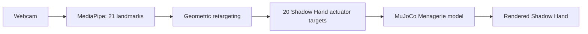

# Shadow Hand Teleoperation

**Webcam hand pose → MediaPipe landmarks → retargeting → real MuJoCo Shadow Hand.**


This is a research PoC for Shadow Hand teleoperation with the real [DeepMind MuJoCo Menagerie Shadow Hand](https://github.com/google-deepmind/mujoco_menagerie/tree/main/shadow_hand). The core loop is:

```text
webcam hand pose → MediaPipe landmarks → retargeting → MuJoCo actuators → Shadow Hand motion
```

We use the real Menagerie MJCF and real `mj_step` physics. The project has two public demo paths and one native research path.

## Space paths



| Path | What it does |
|---|---|
| **`/browser`** | Fastest demo. MediaPipe + MuJoCo-WASM run in your browser; webcam frames stay local. |
| **`/server`** | Fallback demo. MediaPipe + MuJoCo run on the Space and rendered frames are streamed back. |
| **Native local** | Source-of-truth research path for tactile sensors, diagnostics, tuning, and future experiments. |

`/` opens the browser path by default.

## What is implemented now

- real MuJoCo Menagerie Shadow Hand assets
- MediaPipe-to-actuator retargeting
- native MuJoCo teleoperation app
- browser MuJoCo-WASM teleoperation path
- native tactile/contact sensor experiment
- native diagnostics for:
  - per-sensor contact activity
  - linear signal traces
  - heatmap-style contact summary
  - CSV logging for later analysis

The WASM path now reproduces the native model's visual and retargeting behaviour locally: it compiles the same MJCF (matching `nq 29` / `nu 25`), steps the same `mj_step` physics, and its retargeting matches the Python mapping to floating-point rounding. See [`docs/WASM.md`](docs/WASM.md).

## Current experiment status

- [x] Menagerie Shadow Hand MJCF and mesh assets
- [x] 20 actuator targets from MediaPipe geometry
- [x] MuJoCo stepping and native local viewer
- [x] Per-frame landmark / actuator CSV logging
- [x] Browser-side MediaPipe prototype
- [x] Browser-side MuJoCo-WASM renderer and retargeting parity (verified: max actuator delta 3.9e-15 over 300 samples)
- [x] Tactile/contact sensors and native contact-readout experiments
- [ ] Contact-driven grasp evaluation
- [ ] Optimization layer for user-pose ↔ robot-pose matching

## Sensor experiment

The native MuJoCo app now includes tactile/contact sensors on the Shadow Hand plus a dynamic test object for grasp experiments.

Current sensor readouts:

- raw touch/contact values
- smoothed static-contact estimate
- held peak / transient spike tracking
- per-sensor heatmap-style summary
- aggregate contact totals for quick grasp checks

This is still a PoC. The current goal is to make sensing readable, stable, and fast enough for iteration on a laptop before building more advanced grasp logic.

## Run the reference system locally

The local application is the source of truth for physics and future sensor work. It requires Python 3.10, MuJoCo, and a webcam.

```bash
uv sync
uv run mjpython -m shadow_hand.main
```

Press `ESC` or `Q` in the MuJoCo window to quit. Recorded samples are written to `data/hand_log.csv` unless `--no-record` is passed.

Useful native variants:

```bash
uv run mjpython -m shadow_hand.main --no-cv2
uv run mjpython -m shadow_hand.main --no-sensor-panel
```

## Retargeting experiment

Each video frame produces 21 MediaPipe points. `compute_signals()` extracts finger curl, signed spread, and thumb-opposition signals. The mapping table in [`shadow_hand/settings.py`](shadow_hand/settings.py) converts those signals to the 20 position-actuator targets, then an EMA smooths the targets before the simulation advances.

```text
21 landmarks → curl / spread / thumb-opposition → ACTUATOR_MAP + optional synergy prior → data.ctrl[20] → mj_step → Shadow Hand state
```

The CSV log keeps the time-aligned landmarks and actuator targets. It is the dataset scaffold for future EMG/EEG decoders and learned retargeting.

## Browser WASM workbench

```bash
npm install
npm run dev -- --port 5173
```

Open `http://127.0.0.1:5173`. It loads the same Menagerie XML and mesh assets into official MuJoCo WASM and compiles the MJCF in-browser; webcam frames never leave the machine.

The retargeting in [`web/retarget.js`](web/retarget.js) is a direct port of `settings.py` / `model.py` and is checked numerically against the Python implementation — 300 random landmark sets, 20 actuators each, max delta `3.9e-15`. Gains live in `shadow_hand/settings.py`; change them there and port, rather than tuning the two sides independently.

`npm run build` produces a fully static `dist/` (~17 MB, mostly the MuJoCo WASM binary). Architecture, parity method, coordinate-frame pitfalls and known differences are documented in [`docs/WASM.md`](docs/WASM.md).

## Next steps

- improve native UI quality and reduce laptop lag
- make tactile readouts easier to read during grasping
- add grasp objects and contact-driven evaluation
- add an optimization layer:

```text
user hand pose → robot target pose → robot forward pose estimate → minimize pose error
```

- extend from actuator-level mapping toward fuller joint-space reconstruction

## Project map

```text
shadow_hand/       native MuJoCo reference application
space_assets/      Menagerie Shadow Hand MJCF and visual assets
web/               browser MuJoCo-WASM path (engine, retargeting, render)
public/mujoco/     scene assets served to the browser build
data/              recorded landmark / actuator samples
docs/              experiment notes and design rationale
```

## References

- DeepMind, [MuJoCo Menagerie: Shadow Hand](https://github.com/google-deepmind/mujoco_menagerie/tree/main/shadow_hand)
- Santello, Flanders & Soechting (1998), *Postural Hand Synergies for Tool Use*
- Google, [MediaPipe Hands](https://ai.google.dev/edge/mediapipe/solutions/vision/hand_landmarker)
