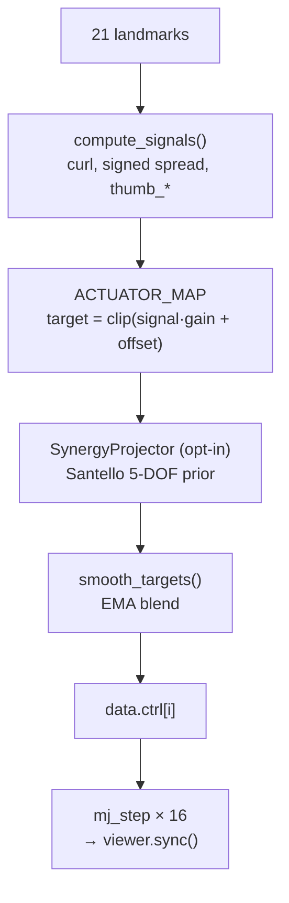

# 🦾 Shadow Hand teleop — MediaPipe → MuJoCo

> Educational project. Real-time teleoperation of the DeepMind Menagerie
> Shadow Hand in MuJoCo, driven today by webcam-based hand pose, and
> designed to accept **EMG / EEG / video** signals tomorrow.


## Hosted demo

The Hugging Face Space runs entirely in the browser: webcam → MediaPipe
landmarks → retargeted WebGL hand. No webcam frames are sent to the server.
The native MuJoCo viewer path remains available locally.

## What this is

- **Input today:** webcam → MediaPipe → 21 hand landmarks
- **Output:** 20-actuator Shadow Hand in MuJoCo, controlled in real time
- **Why this shape:** the whole pipeline funnels through one function —
  `compute_signals(landmarks)` — so any future signal source (EMG
  envelopes, EEG features, a learned video → pose model) plugs in by
  replacing that one call, leaving the actuator mapping, smoothing, and
  viewer intact.

## Quick start

Requires Python 3.10 and a webcam. (`mjpython` ships with `mujoco`; macOS
needs it for the interactive viewer.)

```bash
uv venv --python 3.10
uv pip install mediapipe mujoco opencv-python numpy
uv run mjpython -m shadow_hand.main
```

Press **ESC** or **Q** in the MuJoCo window to quit.

| flag | effect |
|------|--------|
| `--no-record` | don't write `data/hand_log.csv` |
| `--no-cv2`    | don't open the webcam preview window |
| `--log-level DEBUG` | verbose logs |

## Architecture

Three concurrent layers, decoupled by single-slot queues:

```mermaid
flowchart LR
    cam[Webcam] -->|frames| trk["tracking.py<br/>MediaPipe<br/>(BG thread)"]
    trk -->|Queue(1)<br/>21 landmarks| ctl["main.py<br/>control loop<br/>30 Hz"]
    ctl -->|mp.Queue| prev[cv2 preview<br/>subprocess]
    ctl --> mj[(MuJoCo viewer)]
```

MediaPipe takes 30–50 ms per frame on CPU. Running it inline would tank
the sim. The single-slot queue means the control loop always reads the
freshest landmarks and never blocks.

## Per-frame pipeline



[shadow_hand/settings.py](shadow_hand/settings.py) is the single source
of truth — one row per actuator: `(signal, gain, offset, clip)`. Tune
the mapping by editing that table; restart to pick up changes.

## Theory cheatsheet

**Finger curl** — ratio of straight to bent path through MCP→PIP→DIP→TIP.
Robust under MediaPipe noise because it cancels overall hand scale:

$$
\text{curl} = 1 - \frac{\|p_{tip} - p_{mcp}\|}
                       {\|p_{pip}-p_{mcp}\| + \|p_{dip}-p_{pip}\| + \|p_{tip}-p_{dip}\|}
$$

**Signed 2D spread** — angle from the middle-finger ray to this-finger
ray in the image plane. The sign distinguishes outward fan from inward
crossing — unsigned angles can't:

$$
\theta = \mathrm{atan2}\!\bigl(v_{m,x}\,v_{f,y} - v_{m,y}\,v_{f,x},\; v_m\cdot v_f\bigr)
$$

**Thumb opposition** — `thumb_tip ↔ pinky_MCP` distance normalized by
palm width. 1.0 ≈ closed pinch, 0 ≈ open.

**Santello synergy prior** — humans use ~5 effective DOFs out of the
hand's 20+ (Santello, Flanders & Soechting, 1998). `SynergyProjector`
projects the 20-dim target onto a 5-dim subspace and back, smoothing
noise and suppressing impossible poses. Opt-in.

## Data recording

Every frame is logged to `data/hand_log.csv`:

```
timestamp_ms, mp_0_x, mp_0_y, mp_0_z, …, mp_20_z, rh_A_WRJ2, rh_A_WRJ1, …
```

This is the training scaffold for the biosignal path: time-aligned
(landmarks, actuator targets) ground truth a future EMG / EEG decoder
can be supervised against.

### Example: replacing MediaPipe with a custom signal source

The whole input side is one swap:

```python
# shadow_hand/model.py
def compute_signals(features):    # was: keypoints
    # features can be EMG envelopes, EEG band powers, or learned pose
    return {
        "curl_index":   my_decoder(features, "index"),
        "spread_index": my_decoder(features, "index_spread"),
        # ...
    }
```

`extract_shadow_hand_targets`, smoothing, viewer, and CSV recording
stay unchanged.

## Project layout

```
shadow_hand/         ← active path
  main.py            ← control loop, viewer
  tracking.py        ← camera + MediaPipe (background thread)
  model.py           ← compute_signals, extract_shadow_hand_targets
  settings.py        ← ACTUATOR_MAP, paths, FPS
  mano_pipeline.py   ← SynergyProjector + MANO scaffold (opt-in)
pybullet_hand/       ← legacy PyBullet path, archived
experiments/         ← notebooks, scratch (rnn, diffusion, drawing)
assets/              ← MuJoCo Menagerie Shadow Hand XMLs, screenshots
docs/                ← ARCHITECTURE / RETARGETING / CHANGES
data/                ← hand_log.csv recordings
tests/               ← cv / mujoco / thumb sanity tests
```

## Roadmap

- [x] PyBullet URDF version (archived under [pybullet_hand/](pybullet_hand/))
- [x] MuJoCo Shadow Hand teleop
- [x] Concurrent perception (camera + MediaPipe off the control loop)
- [x] Santello synergy projector (opt-in)
- [ ] EMG envelope → `compute_signals` (replace MediaPipe input)
- [ ] EEG / motor-imagery decoder
- [ ] Video → MANO → Shadow retargeting — see [docs/RETARGETING.md](docs/RETARGETING.md)
- [ ] Tactile sensing in MuJoCo
- [ ] Learned residual on top of geometric mapping

## Abbreviations

- **DOF** — degree of freedom
- **MCP** — metacarpophalangeal joint (palm ↔ finger knuckle)
- **PIP** — proximal interphalangeal (middle knuckle)
- **DIP** — distal interphalangeal (top knuckle)
- **CMC** — carpometacarpal (thumb base)
- **EMA** — exponential moving average

## References

- DeepMind Menagerie — Shadow Hand: https://github.com/google-deepmind/mujoco_menagerie/tree/main/shadow_hand
- Santello, Flanders & Soechting (1998), *Postural Hand Synergies for Tool Use*, J. Neuroscience.
- MediaPipe Hands — 21-point landmark model.
- Tactile sensing + DDPG for in-hand manipulation — https://www.frontiersin.org/journals/robotics-and-ai/articles/10.3389/frobt.2021.538773/full
