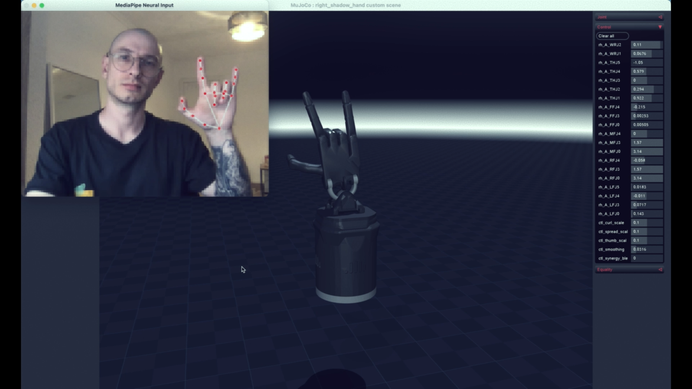
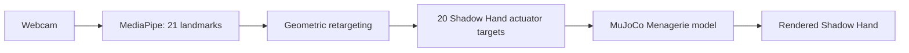

# Shadow Hand Teleoperation

**Webcam hand pose → MediaPipe landmarks → retargeting → real MuJoCo Shadow Hand.**



This is a research PoC for controlling the [DeepMind MuJoCo Menagerie Shadow Hand](https://github.com/google-deepmind/mujoco_menagerie/tree/main/shadow_hand) from a webcam. It is not a PyBullet demo and it does not use an animated hand substitute: the native reference application uses the Menagerie MJCF, MuJoCo position actuators, and `mj_step` physics.

## Two execution paths



| Path | Purpose | Engine |
|---|---|---|
| **Native local** | Research, tuning, contact/tactile-sensor experiments | MuJoCo Python + native viewer |
| **This Hugging Face Space** | Public interactive demonstration | Headless MuJoCo + streamed render |
| **Local WASM experiment** | Low-latency browser prototype, tested before deployment | Official MuJoCo compiled to WebAssembly |

The WASM path is an active experiment; it only becomes the hosted demo after it reproduces the real model’s visual and retargeting behaviour locally.

## Current experiment status

- [x] Menagerie Shadow Hand MJCF and mesh assets
- [x] 20 actuator targets from MediaPipe geometry
- [x] MuJoCo stepping and native local viewer
- [x] Per-frame landmark / actuator CSV logging
- [x] Browser-side MediaPipe prototype
- [~] Browser-side MuJoCo-WASM renderer and retargeting parity
- [ ] Tactile/contact sensors and contact-readout experiments

## Run the reference system locally

The local application is the source of truth for physics and future sensor work. It requires Python 3.10, MuJoCo, and a webcam.

```bash
uv venv --python 3.10
uv pip install mediapipe mujoco opencv-python numpy
uv run mjpython -m shadow_hand.main
```

Press `ESC` or `Q` in the MuJoCo window to quit. Recorded samples are written to `data/hand_log.csv` unless `--no-record` is passed.

## Retargeting experiment

Each video frame produces 21 MediaPipe points. `compute_signals()` extracts finger curl, signed spread, and thumb-opposition signals. The mapping table in [`shadow_hand/settings.py`](shadow_hand/settings.py) converts those signals to the 20 position-actuator targets, then an EMA smooths the targets before the simulation advances.

```text
21 landmarks
     │
     ▼
curl / spread / thumb-opposition
     │
     ▼
ACTUATOR_MAP + optional synergy prior
     │
     ▼
data.ctrl[20] → mj_step → Shadow Hand state
```

The CSV log keeps the time-aligned landmarks and actuator targets. It is the dataset scaffold for future EMG/EEG decoders and learned retargeting.

## Reproducible local WASM workbench

The experimental browser workbench runs locally only:

```bash
npm install
npm run dev -- --port 5180
```

Open `http://127.0.0.1:5180`. It loads the same Menagerie XML and mesh assets into official MuJoCo WASM; webcam frames remain in the browser. This is being validated against the native reference before it replaces the public Space.

## Project map

```text
shadow_hand/       native MuJoCo reference application
space_assets/      Menagerie Shadow Hand MJCF and visual assets
web/               local MuJoCo-WASM experiment
data/              recorded landmark / actuator samples
docs/              experiment notes and design rationale
```

## References

- DeepMind, [MuJoCo Menagerie: Shadow Hand](https://github.com/google-deepmind/mujoco_menagerie/tree/main/shadow_hand)
- Santello, Flanders & Soechting (1998), *Postural Hand Synergies for Tool Use*
- Google, [MediaPipe Hands](https://ai.google.dev/edge/mediapipe/solutions/vision/hand_landmarker)
