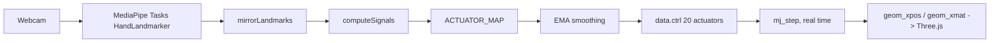

# Browser WASM path

The browser workbench runs the **same MuJoCo model and the same retargeting
math** as the native reference application — not an approximation of it. This
document records how that parity is achieved, how it is verified, and the
coordinate-frame pitfalls that made the first implementation look wrong.

## Is this real MuJoCo?

Yes. `@mujoco/mujoco` 3.11.0 is the official MuJoCo engine compiled to
WebAssembly. The browser build:

1. Writes `my_scene.xml`, `right_hand.xml` and all 14 Menagerie `.obj` meshes
   into the WASM virtual filesystem, so `<include>` and `meshdir` resolution
   behave exactly as on disk.
2. Compiles the MJCF with `MjModel.from_xml_path()` — the real compiler, not a
   pre-baked scene.
3. Advances the simulation with `mj_step()` and position actuators.
4. Renders by reading each geom's world transform (`geom_xpos` / `geom_xmat`)
   straight out of `mjData`. Three.js is a *display layer only*; it owns no
   kinematics and rebuilds no joint hierarchy.

The compiled model dimensions match the native build exactly:

| | nq | nu | ngeom |
|---|---|---|---|
| Native (`mujoco` Python) | 29 | 25 | 63 |
| Browser (`@mujoco/mujoco` WASM) | 29 | 25 | 63 |

Of the 63 geoms, 24 are visual (`group=2`) meshes and are the ones drawn; the
rest are collision geometry.

## Pipeline



| Concern | File |
|---|---|
| Model load, VFS staging, MJCF compile | [`web/mujoco-engine.js`](../web/mujoco-engine.js) |
| Retargeting port (signals, map, smoothing) | [`web/retarget.js`](../web/retarget.js) |
| Render, camera path, control loop | [`web/app.js`](../web/app.js) |

## Retargeting parity

[`web/retarget.js`](../web/retarget.js) is a direct port of:

- `ACTUATOR_MAP`, `FINGER_LANDMARKS`, `SMOOTHING_FACTOR` — `shadow_hand/settings.py`
- `compute_signals()`, `extract_shadow_hand_targets()` — `shadow_hand/model.py`
- `smooth_targets()`, physics stepping rate — `shadow_hand/main.py`

Gains, offsets and clip ranges are tied to the joint limits in `right_hand.xml`.
**Retune them in `settings.py`, then port the change** — do not tune the two
implementations independently or they will drift apart.

### Verification

Parity is checked numerically rather than by eye: 300 random landmark sets are
pushed through both implementations and all 20 actuator outputs compared.

```
samples: 300   comparisons: 6000   actuators: 20
maxAbsDiff: 3.9e-15
```

That is equality to floating-point rounding. Re-run this whenever either side
of the mapping changes.

### Runtime settings matched to the native loop

| Setting | Native | Browser |
|---|---|---|
| Control / inference rate | 30 FPS loop | 30 Hz (33 ms throttle) |
| Physics | 16 × 0.002 s per frame (real time) | wall-clock driven, 0.002 s steps |
| Target smoothing | EMA, factor 0.1 | EMA, factor 0.1 |
| Detection confidence | 0.7 | 0.7 |
| Tracking confidence | 0.5 (MediaPipe default) | 0.5 |

Physics is driven from the wall clock rather than the frame count: the render
loop runs at 60 FPS, so a fixed step count per frame would run the dynamics at
roughly double real time. A 0.25 s catch-up cap keeps a backgrounded tab from
spiralling. Physics also steps every frame regardless of whether a hand was
detected, matching the native loop where the physics block sits outside the
`if keypoints is not None` branch.

## Coordinate-frame pitfalls

These are the non-obvious traps. All three produced plausible-looking but wrong
output, and none of them raise an error.

**1. `Matrix4.set()` is row-major.** MuJoCo's `xmat` is row-major too, so the
rotation maps across directly — but the translation belongs in the *fourth
column*, not the bottom row. Putting it in the bottom row (the column-major
layout) silently yields a projective matrix: the translation is dropped and the
perspective divide smears every geom toward the origin.

**2. Do not sandwich the world transform.** `convert · M · convert⁻¹` is the
change of basis for a matrix whose geometry has *also* been rebased. Mesh
vertices here stay in MuJoCo's raw Z-up local frame, so the correct composition
is `convert · M`. The trailing inverse rotates each part 90° about its own
origin and the hand renders exploded.

**3. Do not apply `mesh_pos` / `mesh_quat`.** MuJoCo 3.x exposes these, and
applying them looks principled, but `geom_xpos`/`geom_xmat` already account for
the mesh frame. Applying them again re-introduces per-part offsets.

**4. MediaPipe landmarks must be mirrored.** `tracking.py` calls
`cv2.flip(frame, 1)` *before* inference, so every sign convention in
`ACTUATOR_MAP` — spread direction, thumb opposition — assumes mirrored
landmarks. The browser feeds the raw camera frame (its preview is mirrored in
CSS only), so `mirrorLandmarks()` applies `x -> 1 - x` before retargeting. The
landmark overlay still draws from raw coordinates, since the canvas inherits
the same CSS mirror.

## Camera / tracker lifecycle

`HandLandmarker` is assigned before `getUserMedia()` resolves, so a render loop
that starts at page load can reach inference while the video element still has
no frame. Feeding MediaPipe a 0×0 frame fails its `ImageToTensor` ROI check and
**permanently poisons the graph** — every later call fails and tracking never
recovers. The loop therefore gates inference on `readyState >= 2` and non-zero
`videoWidth`/`videoHeight`.

The status line distinguishes the two failure modes rather than collapsing them
into one silent "waiting" state: `Tracker error: …` versus `No hand in frame`.

## Known differences from the native path

- **Different MediaPipe model.** Native uses the legacy `mp.solutions.hands`;
  the browser uses Tasks `hand_landmarker.task` (float16). The retargeting math
  is identical, but the landmarks entering it differ slightly, so poses track
  closely without matching sample-for-sample.
- **Synergy projection not ported.** `synergy.project()` is bypassed at the
  default `blend = 0.0`, so this only matters if that slider is moved.
- **Calibration sliders not exposed.** The browser hardcodes the defaults
  (curl / spread / thumb = 1.0, smoothing = 0.1).
- **Engine versions differ.** Native runs `mujoco` 3.8.1, the browser 3.11.0.

## Build

```bash
npm install
npm run dev -- --port 5173     # workbench
npm run build                  # static output in dist/
npm run preview                # serve the built output
```

The build is fully static — `dist/` is an `index.html`, a JS bundle, the
~10 MB MuJoCo WASM binary, and the `public/mujoco/` scene assets (~17 MB
total). Everything except the MediaPipe WASM runtime and the hand-landmarker
model is self-hosted; those two are still fetched from CDNs at runtime.

## Deployment: both paths, one Space

The Hugging Face Space (`sdk: docker`) serves both execution paths so they can
be compared side by side, with a link switching between them:

| Route | Path | Physics | Video |
|---|---|---|---|
| `/browser` | static WASM build | in the client | never leaves the browser |
| `/server` | Gradio app (`app.py`) | on the Space CPU | uploaded per frame |
| `/` | redirects to `/browser` | — | — |

`/` prefers the browser path because it is faster and costs no Space CPU per
visitor. The server path remains available for machines where WASM or WebGL is
unavailable, and as the reference rendering.

The [`Dockerfile`](../Dockerfile) is two stages: a `node:20-slim` stage runs
`npm ci && npm run build` to produce `dist/`, and the Python runtime stage
copies it in and mounts it with `StaticFiles`. `app.py` wraps the Gradio
`Blocks` in a FastAPI app via `gr.mount_gradio_app(..., path="/server")`.

If `dist/` is absent (a plain `python app.py` with no build), `/browser` is
simply not mounted and `/` falls through to `/server` — the server path never
depends on the browser build.

`.dockerignore` is an allow-list, so the browser build inputs (`package.json`,
`package-lock.json`, `index.html`, `web/`, `public/`) must stay listed there or
the node stage builds nothing. `node_modules/` and `dist/` are deliberately
excluded: dependencies install and the bundle builds inside the image.
